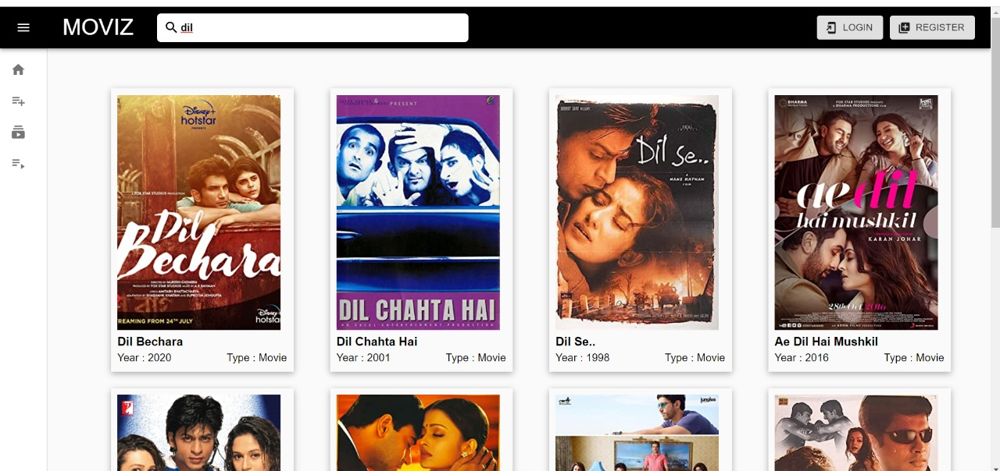
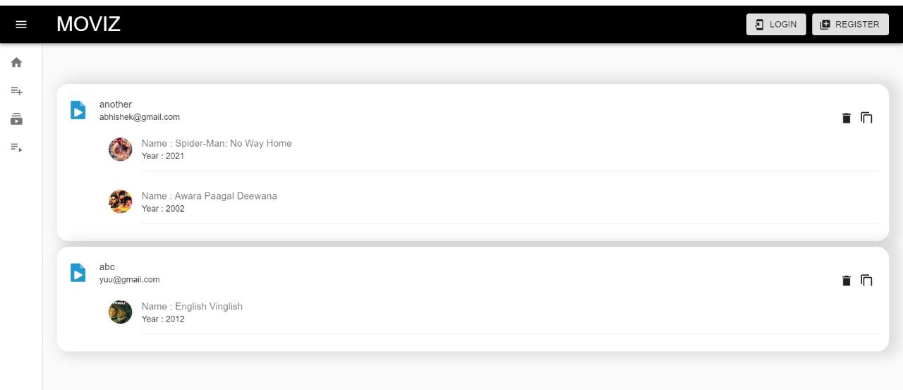
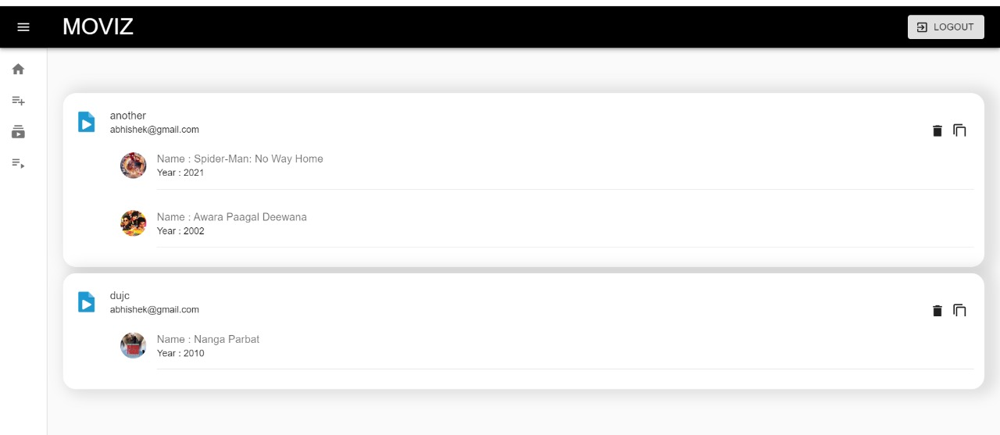
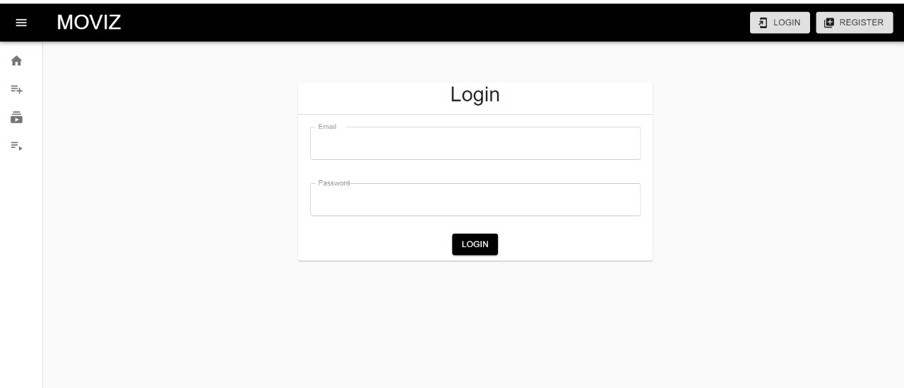
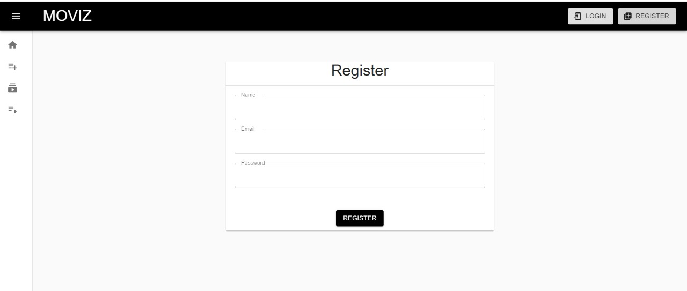
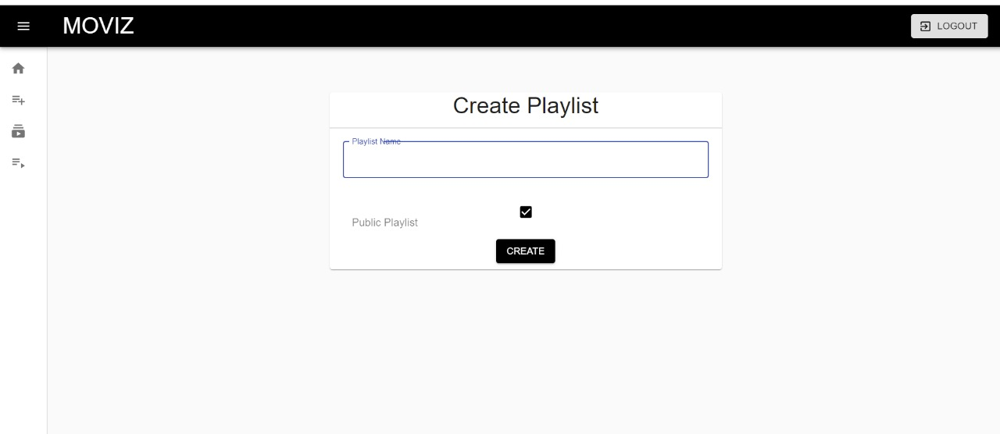

# MoviesPlaylist

>Test Login 
    <b>email ---- abhishek@gmail.com</b>  
    <b>password ---- 12345678</b>  

<h2 style="text-align:center, display:flex, justify-content:center, margin:auto"><a href="https://youtu.be/sxoipiDts34">DEMO VIDEO</a></h2>

## `Steps to launch`
>  <b>For Frontend ---></b> git clone https://github.com/abhi-43/Moviz-frontend-task  
<b>For Backend ----></b> git clone https://github.com/abhi-43/Moviz-backend-task

---

## `Installation and Setup Instructions`

- Clone down this repository. You will need `node` and `npm` installed globally on your machine.
- Installation:`npm install`
- To Start Server: `npm start`
- Add Backend URL in src/contexts/GlobalContext.js
- To Visit app locally: `localhost:3000/`

## `Screenshots`

<table>
   <tr align=center>
     <td  colspan=3>Home Page </td>
  </tr>
   <tr align=center>
     <td  colspan=3> Public Shared Playlist </td>
  </tr>
  <tr>
    <td>All Playlist </td>
    <td>My Public Playlist</td>
  <tr>
   <td>Login</td>
     <td>Register</td>
     <td>Create Playlist</td>
  </tr>
</table>

##  `Built With`

<table  align=center>
  <tr>
   <td align=center> </td>
    <td align=center> </td>
     <td align=center> </td>
     
  </tr>

</table>

